# LTA Application - Workflows Documentation

## Table of Contents

1. [Authentication Workflows](#authentication-workflows)
2. [LTA Management Workflows](#lta-management-workflows)
3. [Order Fulfillment Workflows](#order-fulfillment-workflows)
4. [Price Management Workflows](#price-management-workflows)
5. [Feedback & Issue Workflows](#feedback--issue-workflows)
6. [Order Modification Workflows](#order-modification-workflows)
7. [Document Management Workflows](#document-management-workflows)

---

## Authentication Workflows

### 1. User Login Flow

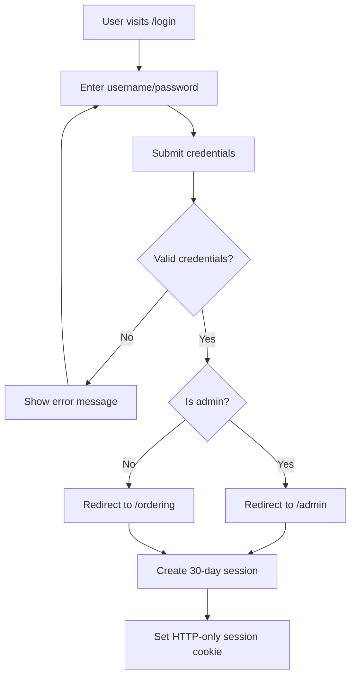

**Steps**:
1. User navigates to `/login`
2. Frontend displays login form
3. User enters username and password
4. Frontend POSTs to `/api/auth/login`
5. Backend validates credentials with Passport.js
6. Backend checks password hash (scrypt)
7. If valid:
   - Create session in PostgreSQL
   - Set secure HTTP-only cookie (30-day expiry)
   - Return user object with `isAdmin` flag
8. Frontend redirects based on role:
   - Admin → `/admin` dashboard
   - Client → `/ordering` page

**Session Details**:
- **Storage**: PostgreSQL via connect-pg-simple
- **Cookie Name**: `connect.sid`
- **Max Age**: 30 days
- **Security**: HTTP-only, secure flag in production

---

### 2. Password Reset Flow

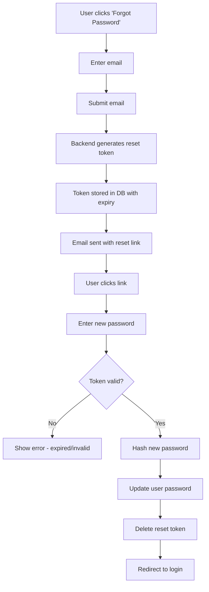

**Steps**:
1. User clicks "Forgot Password" on login page
2. User enters email address
3. Backend generates random token
4. Token stored in `password_reset_tokens` table with 1-hour expiry
5. Email sent to user (implementation varies)
6. User clicks reset link: `/reset-password?token=xxx`
7. User enters new password
8. Backend validates token (exists and not expired)
9. Password hashed with scrypt
10. User password updated
11. Token deleted from database
12. User redirected to login

---

### 3. Session Validation Flow

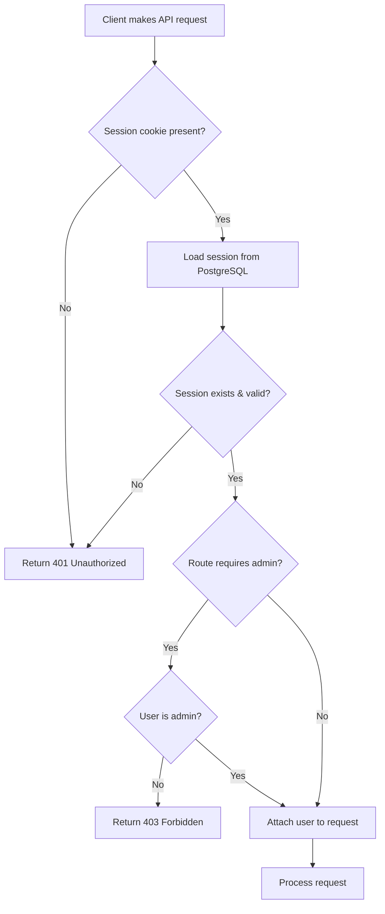

**Middleware Chain**:
1. `requireAuth` - Checks if user is logged in
2. `requireAdmin` - Checks if user has admin privileges

**Protected Routes**:
- All `/api/client/*` routes → require authentication
- All `/api/admin/*` routes → require admin + authentication

---

## LTA Management Workflows

### 1. Create LTA with Product & Client Assignments

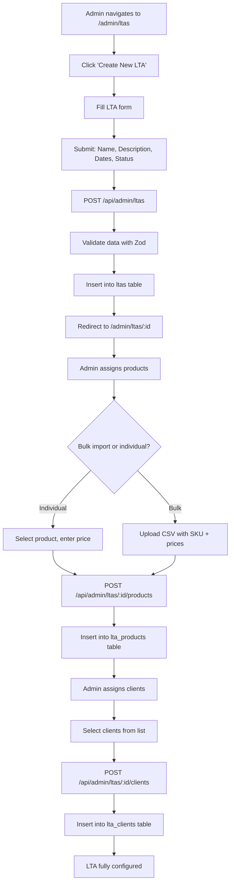

**Database Changes**:
1. `ltas` table - New LTA record
2. `lta_products` table - Product assignments with contract pricing
3. `lta_clients` table - Client access grants

**Constraints**:
- `lta_products` has UNIQUE constraint on (ltaId, productId) - can't assign same product twice
- `lta_clients` has UNIQUE constraint on (ltaId, clientId) - can't assign same client twice

---

### 2. Bulk Product Assignment via CSV

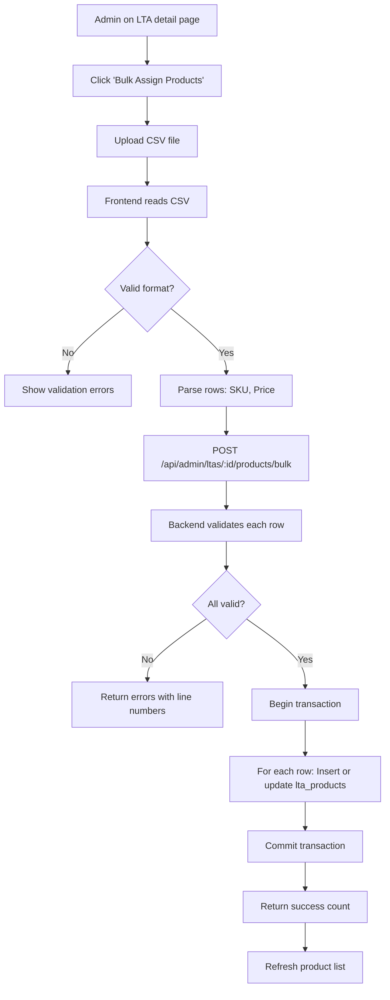

**CSV Format**:
```csv
SKU,Contract Price
PROD-001,29.99
PROD-002,149.50
```

**Validation**:
- SKU must exist in products table
- Price must be valid decimal number
- Price must be positive

---

## Order Fulfillment Workflows

### 1. Complete Order Placement Flow

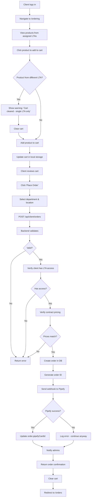

**Critical Validations**:
1. **Single-LTA Rule**: All cart items must belong to same LTA
2. **Client Authorization**: Client must be assigned to the LTA
3. **Price Verification**: Order prices must match `lta_products.contract_price`
4. **Stock Availability**: (if implemented) - currently not enforced

**Database Changes**:
1. `orders` table - New order record
2. `notifications` table - Admin notification created

**External Integration**:
- Pipefy webhook receives order data (non-blocking)

---

### 2. Order Status Update Flow

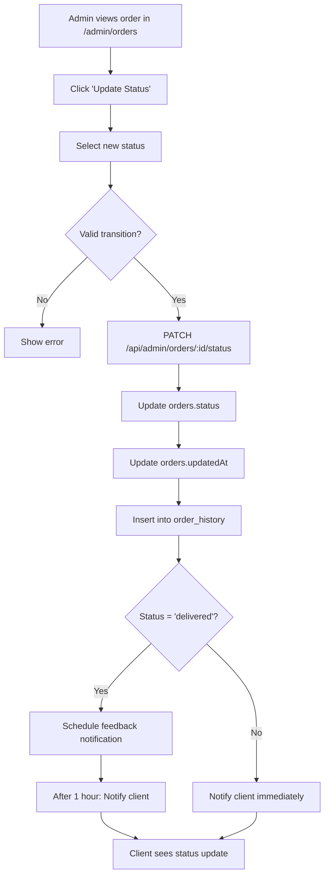

**Status Transitions**:
```
pending → confirmed → processing → shipped → delivered
         ↘ cancelled
```

**Special Cases**:
- **Delivered**: Triggers feedback notification 1 hour later
- **Cancelled**: Requires cancellation reason

---

### 3. Reorder from Order History

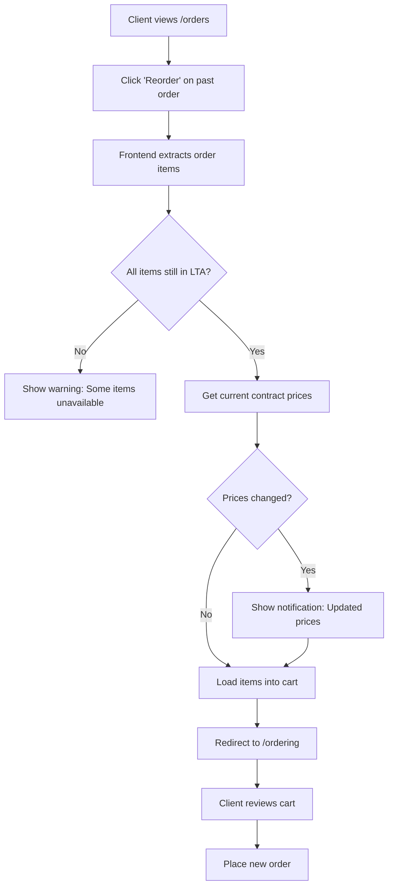

**Price Update**: Reorders always use CURRENT contract pricing, not historical pricing

---

## Price Management Workflows

### 1. Price Request & Offer Flow

```mermaid
graph TD
    A[Client navigates to /price-request] --> B[Select LTA]
    B --> C[Select products needing quotes]
    C --> D[Enter quantities for each product]
    D --> E[Add optional notes]
    E --> F[Submit request]
    F --> G[POST /api/price-requests]
    G --> H[Generate request number: PR-timestamp-####]
    H --> I[Insert into price_requests table]
    I --> J[Notify ALL admins]
    J --> K[Notify client: Request submitted]
    K --> L[Admin views /admin/price-requests]
    L --> M[Admin clicks 'Create Offer from Request']
    M --> N[Form pre-filled with request data]
    N --> O[Admin adjusts prices/adds tax]
    O --> P[Admin sets validity date]
    P --> Q[POST /api/admin/price-offers]
    Q --> R[Generate offer number: PO-timestamp-####]
    R --> S[Insert into price_offers table]
    S --> T[Status = 'draft']
    T --> U[Admin clicks 'Send Offer']
    U --> V[POST /api/admin/price-offers/:id/send]
    V --> W[Load active price_offer template]
    W --> X[Generate PDF with PDFKit]
    X --> Y[Apply Arabic text reshaping]
    Y --> Z[Save PDF to Object Storage]
    Z --> AA[Update offer.pdfPath]
    AA --> AB[Update offer.status = 'sent']
    AB --> AC[Notify client: New offer available]
    AC --> AD[Client views /price-offers]
    AD --> AE[Click offer to view details]
    AE --> AF{Auto-mark as viewed}
    AF --> AG[Update offer.status = 'viewed']
    AG --> AH[Client clicks 'Accept' or 'Reject']
    AH --> AI[POST /api/price-offers/:id/respond]
    AI --> AJ{Response type?}
    AJ -->|Accept| AK[Update offer.status = 'accepted']
    AJ -->|Reject| AL[Update offer.status = 'rejected']
    AK --> AM[Notify admins: Offer accepted]
    AL --> AN[Notify admins: Offer rejected]
    AM --> AO[Client can now place order]
```

**Key Points**:
- Request number format: `PR-{timestamp}-{count}`
- Offer number format: `PO-{timestamp}-{count}`
- PDF generation uses active `price_offer` template
- Offers have validity period - cannot respond after expiry

---

### 2. PDF Generation for Price Offers

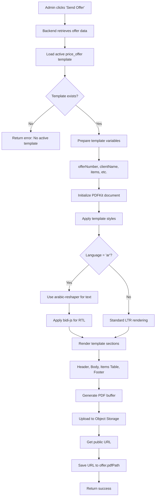

**Template Variables**:
```javascript
{
  offerNumber: "PO-1234567890-0001",
  offerDate: "2024-01-15",
  clientNameEn: "ABC Company",
  clientNameAr: "شركة ABC",
  ltaNameEn: "2024 Supply Agreement",
  items: [{sku, name, quantity, price}],
  subtotal: "1000.00",
  tax: "150.00",
  total: "1150.00",
  validUntil: "2024-02-15",
  companyNameEn: "Al Qadi Trading Company"
}
```

---

## Feedback & Issue Workflows

### 1. Order Feedback Submission Flow

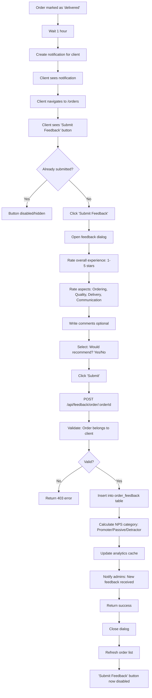

**Critical Points**:
- **Trigger**: 1 hour after delivery (3600000ms)
- **One-time**: Can only submit once per order
- **Separate from Issues**: Completely different button and dialog
- **NPS Calculation**:
  - Rating 5 = Promoter
  - Rating 4 = Passive
  - Rating 1-3 = Detractor

**Database Fields**:
```typescript
{
  orderId: string;
  clientId: string;
  rating: number; // 1-5
  orderingProcessRating: number; // 1-5
  productQualityRating: number; // 1-5
  deliverySpeedRating: number; // 1-5
  communicationRating: number; // 1-5
  comments: string | null;
  wouldRecommend: boolean;
}
```

---

### 2. Issue Reporting Flow (Separate from Feedback)

```mermaid
graph TD
    A[Client on /orders page] --> B[Click 'Report Issue' button]
    B --> C[Open issue report dialog]
    C --> D[Select issue type: Bug/Feature/Performance/etc.]
    D --> E[Select severity: Low/Medium/High/Critical]
    E --> F[Enter title]
    F --> G[Enter detailed description]
    G --> H[Enter steps to reproduce]
    H --> I[Enter expected behavior]
    I --> J[Enter actual behavior]
    J --> K{Want to add screenshots?}
    K -->|Yes| L[Upload images]
    K -->|No| M[Auto-capture browser info]
    L --> M
    M --> N[Auto-capture screen size]
    N --> O[Click 'Submit']
    O --> P[POST /api/feedback/issue]
    P --> Q[Insert into issue_reports table]
    Q --> R[Notify ALL admins regardless of severity]
    R --> S[Return success]
    S --> T[Close dialog]
    T --> U[Show success message]
    U --> V[Admin receives notification]
    V --> W[Admin navigates to /admin/issue-reports]
    W --> X[Admin clicks issue to view details]
    X --> Y[Admin updates status: open→in_progress→resolved→closed]
    Y --> Z[PATCH /api/feedback/issues/:id/status]
    Z --> AA[Update issue_reports.status]
    AA --> AB{Status changed to resolved/closed?}
    AB -->|Yes| AC[Set resolvedAt timestamp]
    AB -->|No| AD[Notify client of status change]
    AC --> AD
```

**Critical Points**:
- **Always Available**: Can report issue for ANY order status
- **Separate from Feedback**: Different button, different dialog
- **All Admins Notified**: Every issue triggers notifications to ALL admins
- **No Severity Filter**: High-priority and low-priority issues BOTH notify admins

**Issue Types**:
- Bug
- Feature Request
- Performance Issue
- Usability Problem
- Content Issue
- Other

**Severity Levels**:
- Low: Minor inconvenience
- Medium: Affects workflow
- High: Major blocker
- Critical: System down

---

### 3. Admin Response to Feedback

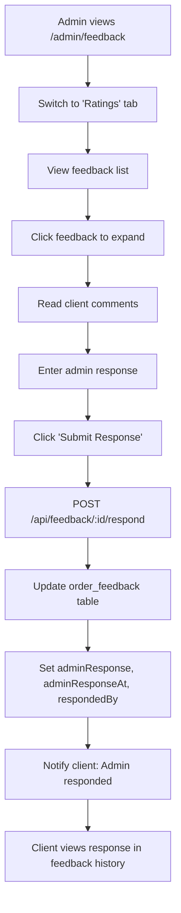

**Response Tracking**:
- `adminResponse`: Text of response
- `adminResponseAt`: Timestamp
- `respondedBy`: Admin client ID

---

## Order Modification Workflows

### 1. Client Request Order Modification

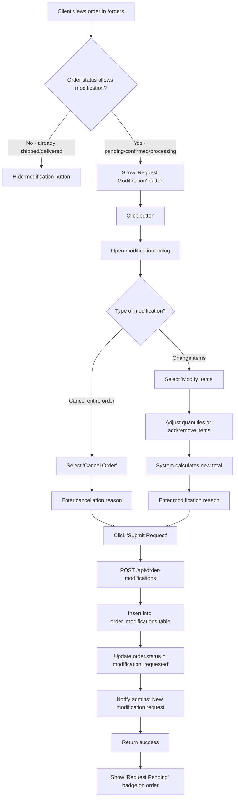

**Modification Types**:
- `items`: Change order items/quantities
- `cancel`: Cancel entire order
- `both`: Combination (rarely used)

**Allowed Statuses**:
- pending
- confirmed  
- processing

**Not Allowed**:
- shipped (too late)
- delivered (completed)
- cancelled (already done)

---

### 2. Admin Review Modification Request

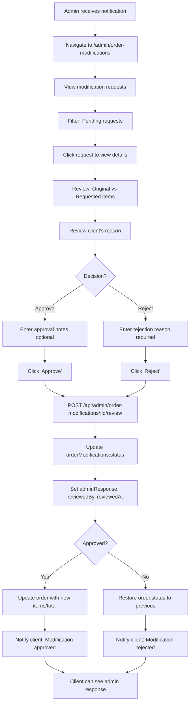

**Admin Response Fields**:
- `status`: 'approved' or 'rejected'
- `adminResponse`: Explanation from admin
- `reviewedBy`: Admin client ID
- `reviewedAt`: Timestamp

**If Approved**:
- Order items updated to `newItems`
- Order total updated to `newTotalAmount`
- Order status changes based on modification type

**If Rejected**:
- Order remains unchanged
- Client can see rejection reason

---

## Document Management Workflows

### 1. Upload LTA Document

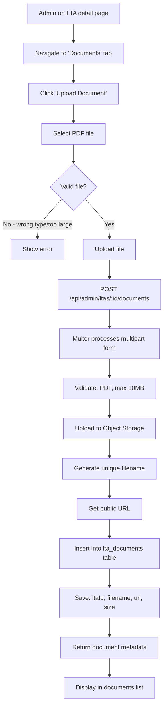

**File Validation**:
- **Allowed Types**: `application/pdf`
- **Max Size**: 10MB
- **Storage**: Replit Object Storage

---

### 2. Template-Based PDF Generation

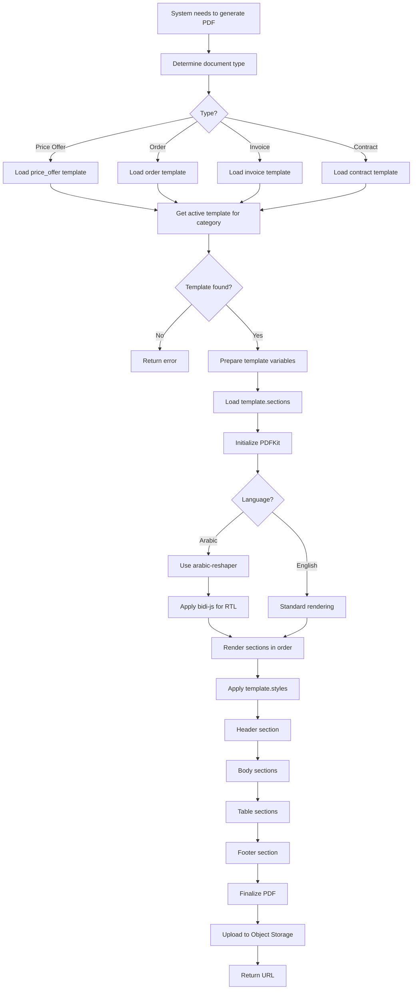

**Template Section Types**:
- `header`: Top of document (logo, title)
- `body`: Main content
- `table`: Tabular data (items, pricing)
- `footer`: Bottom content (signatures, terms)
- `text`: Free text
- `image`: Embedded images

**Template Variables** (examples):
```javascript
{
  documentNumber: "PO-xxx",
  date: "2024-01-15",
  clientName: "ABC Company",
  items: [{name, quantity, price}],
  total: "1000.00",
  ...custom variables
}
```

---

### 3. Template Management Flow

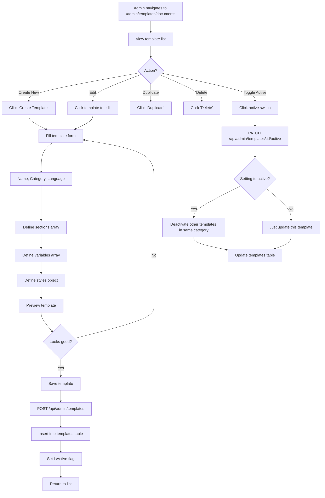

**Template Categories**:
- `price_offer` - Price quotations
- `order` - Order confirmations
- `invoice` - Invoices
- `contract` - LTA contracts
- `report` - Various reports
- `other` - Custom templates

**Active Template Rule**: Only ONE template per category can be active at a time

---

## Integration Workflows

### 1. Pipefy Order Webhook

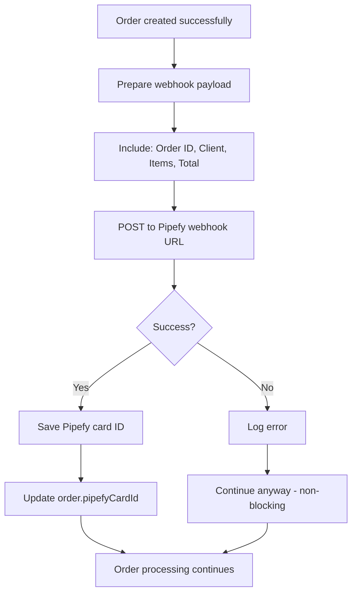

**Webhook Payload**:
```javascript
{
  orderId: "uuid",
  clientName: "ABC Company",
  ltaName: "2024 Supply Agreement",
  items: [{sku, name, quantity, price}],
  total: "1000.00",
  department: "Purchasing",
  location: "Main Office"
}
```

**Error Handling**:
- Webhook failures are logged but don't block order creation
- Admin can manually sync to Pipefy if needed

---

### 2. Session Cleanup Workflow

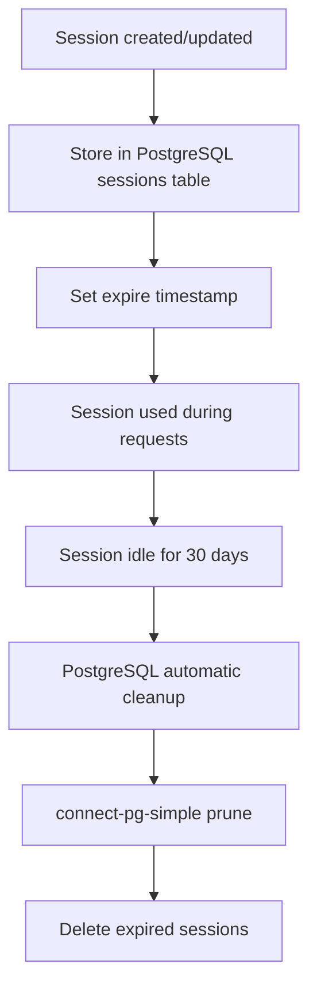

**Session Cleanup**:
- Automatic cleanup by connect-pg-simple
- Runs periodically (default: every 15 minutes)
- Deletes sessions where `expire < NOW()`

---

## Data Synchronization Workflows

### 1. Product Price Sync Flow

```mermaid
graph TD
    A[Admin updates LTA product price] --> B[PATCH /api/admin/ltas/:ltaId/products/:productId]
    B --> C[Update lta_products.contract_price]
    C --> D[Invalidate query cache]
    D --> E[Clients see updated price immediately]
    E --> F[New orders use new price]
    F --> G[Existing orders unchanged]
```

**Price Update Scope**:
- Updates affect NEW orders only
- Historical orders keep original pricing
- Cart prices refreshed on page load

---

### 2. LTA Status Change Propagation

```mermaid
graph TD
    A[Admin changes LTA status to inactive] --> B[PATCH /api/admin/ltas/:id]
    B --> C[Update ltas.status = inactive]
    C --> D[Client product lists refresh]
    D --> E{Products from inactive LTA?}
    E -->|Yes| F[Hide from client view]
    E -->|No| G[Continue displaying]
    F --> H{Products in cart from inactive LTA?}
    H -->|Yes| I[Show warning: LTA no longer active]
    H -->|No| J[No action]
```

**Inactive LTA Rules**:
- Products no longer visible to clients
- Cannot add to cart
- Existing carts show warning
- Orders in progress can complete

---

## Notification Workflows

### 1. Notification Creation & Delivery

```mermaid
graph TD
    A[System event occurs] --> B{Event type?}
    B -->|New Order| C[Notify admins]
    B -->|Order Status Change| D[Notify client]
    B -->|New Feedback| C
    B -->|New Issue Report| C
    B -->|Price Request| C
    B -->|Price Offer| D
    C --> E[Get all admin clients]
    D --> F[Get specific client]
    E --> G[Create notification for each admin]
    F --> H[Create notification for client]
    G --> I[INSERT INTO notifications]
    H --> I
    I --> J[Client sees notification badge]
    J --> K[Client clicks notifications]
    K --> L[Fetch unread notifications]
    L --> M[Display list]
    M --> N[Client clicks notification]
    N --> O[Mark as read]
    O --> P[Navigate to relevant page]
```

**Notification Types**:
- `system`: System-generated events
- `order`: Order updates
- `feedback`: Feedback-related
- `price`: Price request/offer updates

---

## Summary

This document covers the major workflows in the LTA application:

- ✅ Authentication (login, password reset, session management)
- ✅ LTA Management (create, assign products/clients)
- ✅ Order Fulfillment (cart, placement, status updates, reordering)
- ✅ Price Management (requests, offers, PDF generation)
- ✅ Feedback & Issues (separate submission flows)
- ✅ Order Modifications (request and review)
- ✅ Document Management (uploads, PDF generation, templates)
- ✅ Integrations (Pipefy webhook)
- ✅ Notifications (creation and delivery)

Each workflow includes:
- Step-by-step process flows
- Decision points and validations
- Database changes
- API endpoints involved
- Special cases and error handling
